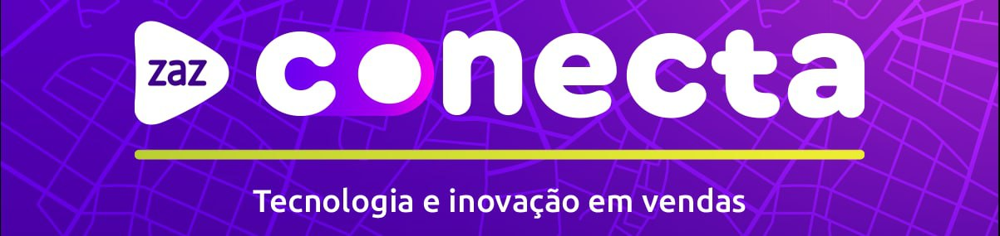

  
<strong>Sumário</strong>

  * [Introdução](#introdução)
    * [Atributo e métricas](#atributo-e-métricas)
  * [Adquirentes Arquivo Processado](#adquirentes-arquivo-processado) 

# Introdução.

Esta documentação tem como objetivo ser um facilitador e propor autonomia para o melhor aproveitamento do cubo de dados.
Todas as informações do Conecta são fornecidas através de cubo de dados utilizando o cube.js, organizados em métricas consistentes e podendo ser usados em qualquer aplicativo.

**Métricas** e **atributos** são a base do cubo. Eles são categorias de informações usadas para medir e organizar seus dados.

# Atributo e métricas

Os atributos nos dizem "como" organizar os resultados. Adicione atributos para informar ao cubo como você deseja organizar e segmentar essas informações por qualidades específicas.

## Adquirentes Arquivo Processado

Abaixo seguem os atributos e suas respectivas descrições para melhor leitura do arquivo processado.

Campo     |    Descrição
--------- | ---------------------------------------------
nomeArquivoEdi | Nome identificador do arquivo.
estabelecimentoMatriz |  Número do estabelecimento matriz de extrato eletrônico.
dataProcessamento | AAAAMMDD – data em que o arquivo foi gerado.
periodoInicial | AAAAMMDD – período inicial.
periodoFinal | AAAAMMDD – período final.
sequencia | Número sequencial do arquivo. Nos casos de reprocessamento,este dado será enviado como 9999999.
opcaoExtrato | Categoria do tipo de extrato.
transmissao | Tipo de transmissão do arquivo (se refere a adquirente)
caixaPostal | Caixa postal.
versaoLayout | Constante “014”.
totalRegistro | Total registro.
numeroTransacoesCanceladas | Número de transações canceladas.
numeroTransacoesPagas | Número de transações pagas.
numeroCancelamentosDescontados | Número de cancelamentos descontados.
numeroChargebacks | Número de contestações.
numeroEstornosChargeback | Número de estornos de contestações.

 ### Ir para o [topo](#introdução).