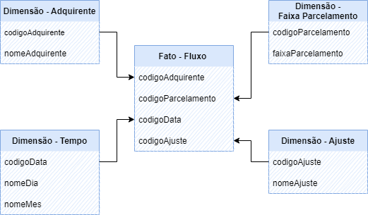

  
<strong>Sumário</strong>

  * [Introdução](#introdução)
    * [O que são atributos?](#o-que-são-atributos)
    * [O que são métricas?](#o-que-são-métricas)
  * [Tabelas Fato](#conceito---tabela-fato)
  * [Tabelas de dimensão](#conceito---tabela-dimensão)
  * [Relação tabela fato x dimensão](#relação-tabela-fato-x-dimensão)
  * [Cube.Js e GraphQl](#cubejs-e-graphql)

# Introdução

Esta documentação tem como objetivo ser um facilitador e propor autonomia para o melhor aproveitamento do cubo de dados.
Todas as informações do Conecta são fornecidas através de cubo de dados utilizando o cube.js, organizados em métricas consistentes e podendo ser usados em qualquer aplicativo.

Para lhe familiarizar com o assunto, vamos dar uma breve introdução aos conceitos de: **Atributo**, **Métricas**, **Tabela Fato**, **Tabela Dimensão** e montagem das querys no **Cube.Js**.

## O que são atributos?

Os atributos nos dizem "como" organizar os resultados. Adicione atributos para informar ao cubo como você deseja organizar e segmentar essas informações por qualidades específicas.

São propriedades (características) que compoem uma tabela fato (ao qual falaremos mais a frente). Uma tabela fato é representada por um conjunto de atributos. 

Adquirente, ajuste, arranjo e tempo, por exemplo, são atributos separados que estão na juntas na fato, mas que quando separadas na query, ajudam a compor uma pesquisa mais afunilada que ajuda na composição da informação para o utilizador deste dado.

## O que são métricas?

Diferente dos **atributos** que compoem informações não quantitativas, as **métricas** são justamente esse tipo de informação, elas ajudam a medir (quantificar) dados úteis. como valor bruto, taxas, tarifas valor líquido, etc.

# Conceito - Tabela Fato

Tabela fato é a tabela no banco de dados com uma quantidade enorme de linhas, e que representa os fatos de um cliente/empresa (por exemplo), que podem se repetir ou não.

Em um banco de dados, uma tabela que armazena os valores detalhados de medidas, ou fatos, é denominada de tabela de fatos. Por exemplo, uma tabela que armazene codigoAdquirente, codigoParcelmento, estabelecimento e valorBruto conforme abaixo: 

codigoAdquirente | codigoParcelmento | estabelecimento | valorBruto 
---------------  | ----------------- | --------------- | ----------
1 | 65489 | 1118742939 | 1398.50
65 | 365987 | 1118742939 | 695.64
1 | 62598 | 2931189 |  1810.99

No caso das colunas codigoAdquirente e codigoParcelmento elas são preenchidas com os números ou código chave dessa informação, na fato elas são apresentadas assim, e quando aprofundada na fato, esses códigos chave correspondem a informação mais detalhada.

# Conceito - Tabela Dimensão

A tabelas de dimensão são criadas para realizar uma leitura dos dados de maneira mais detalhada, para isso é feito a sepração destes dados em dimensões, assim, o leitor destes dados do banco, pode puxar somente as informações que ele deseja para sua leitura, no caso aqui utilizamos o cube.js para essa leitura.
Essa separação também é importante para os casos no qual uma organização não queira deixar visível todas as informações para o leitor, pois em um banco de dados pode conter informações sensiveis como senhas e dados pessoais ao qual nem todos podem ter acesso.

Completando o exemplo de tabela fato anterior, vamos criar uma tabela de dimensão? 
Vamos usar a dimensão adquirente como exemplo:

codigoAdquirente | nomeAdquirente 
---------------  | -------------- 
  1 | Cielo
  2 | Rede
  3 | Getnet

## Relação tabela fato x dimensão

Abaixo podemos um exemplo do relacionamento da tabela fato com a tabela dimensão.

Você pode notar que na tabela fato é utilizado o código chave e na tabela dimensão temos mais detalhes sobre essa informação.

Abaixo é possível ver as tabelas fato que temos disponíveis no cubo hoje:

| Tabela Fato - **AdquirenteFluxo** |
----------------------- | 

### Atributos:
- Adquirente
- Ajuste
- Arranjo
- Faixa parcelamento
- Meio captura
- Tempo
- Tipo de ajuste
- Tipo de pagamento
- Adquirente arquivo processado
- Adquirente Fluxo

### Métricas:
- valorBruto
- taxaAdministrativa
- tarifaAdministrativa
- taxaRecebaRapido
- valoTaxaAdministrativa
- valorLiquido
- valorBrutoAntecipado

| Tabela Fato - **AdquirenteArquivoProcessado** |
------------------------ |

### Atributos:
- [nomeArquivoEdi](docFatoArquivoProcessado.md#adquirentes-arquivo-processado)
- estabelecimentoMatriz
- dataProcessamento
- periodoInicial
- periodoFinal
- sequencia
- opcaoExtrato
- transmissao
- caixaPostal
- versaoLayout

### Métricas:
- totalRegistro
- numeroTransacoesCanceladas
- numeroTransacoesPagas
- numeroCancelamentosDescontados
- numeroChargebacks
- numeroEstornosChargeback

# Cube.Js e GraphQl

Exemplo estrutura de query para consumir o GraphQl

~~~javascript
query CubeQuery {
  cube(where: { adquirente: { nomeAdquirente: { equals: "Cielo" } } }) {
    adquirente(orderBy: { count: desc }) {
      count
      nomeAdquirente
    }
  }
}
~~~

_Ir para o [topo](#introdução)._

 <!-- END graphql-markdown -->